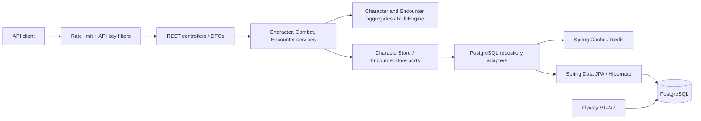

# Themis Engine Project Report

**Assessment date:** 2026-07-18  
**Repository version assessed:** `main` at `beaa57d`  
**Application version:** `0.0.1-SNAPSHOT`

## Executive summary

Themis Engine is a Java 21 and Spring Boot 3.5 backend that models a focused subset of Pathfinder First Edition rules. Its strongest asset is a tested domain model for modifier stacking, character-derived statistics, action economy, spell slots, attacks, and initiative-based encounters. The application exposes those rules through a secured REST API and persists character and encounter aggregates in PostgreSQL, with Redis used as a read/write-through Spring cache.

The project is a functional service rather than only an architectural prototype. A fresh test run completed successfully with **67 tests run, 0 failures, 0 errors, and 1 skipped test**. Seven Flyway migrations were validated and applied against the H2 compatibility database during that run.

The current architecture is best described as **hexagonal-inspired** rather than strictly hexagonal: domain entities are free of persistence and web concerns, and repository ports isolate JPA, but application services and the rule engine live in the domain package and depend on Spring annotations. The codebase is coherent and small enough to evolve safely, but production readiness is limited by default credentials, concurrency controls, rate-limit design, PostgreSQL-specific verification, and incomplete observability/API documentation.

## Assessment scope and method

This report is based on direct inspection of:

- all main and test source files;
- Maven, Spring, Docker, logging, CI, and test configuration;
- REST controllers and DTOs;
- domain aggregates, services, and rule objects;
- JPA entities, adapters, caches, and Flyway migrations;
- the README, implementation walkthrough, and architecture decisions;
- a fresh Maven test execution on Java 21.

Repository snapshot metrics:

| Measure | Count |
| --- | ---: |
| Main Java source files | 70 |
| Test Java source files | 15 |
| REST endpoint methods | 22 |
| Flyway migrations | 7 (6 SQL, 1 Java) |
| Standalone ADRs | 3 |
| Fresh test result | 67 run, 0 failed, 0 errors, 1 skipped |

## Product purpose and implemented capabilities

The application acts as a deterministic rules referee and state manager for character and combat workflows. The implemented scope includes:

- six core attributes and derived modifiers;
- Armor Class, saving throws, base attack bonus, and hit points;
- Pathfinder-style typed modifier stacking, including source-aware stacking;
- generic equipment, melee/ranged/finesse weapons, armor, and Dexterity caps;
- damage, healing, consciousness, and death thresholds;
- timed conditions and condition stacking groups;
- standard, move, swift, free, and full-round action economy rules;
- spellcasting configuration, spell-slot consumption/recovery, and save DCs;
- attack resolution, natural 1/20 rules, critical threats, confirmation, and damage;
- encounter creation, participants, hybrid initiative, turn order, rounds, and turn reset;
- PostgreSQL persistence, Flyway schema management, and Redis caching;
- API-key authentication, per-IP rate limiting, health checks, and JSON logs;
- Docker packaging, Docker Compose, and GitHub Actions CI.

Not yet implemented despite appearing in the original roadmap or dependencies:

- WebSocket/STOMP endpoints or real-time event publication;
- a comprehensive Pathfinder content catalog for classes, feats, spells, prerequisites, and monsters;
- spatial/grid rules, maneuvers, attacks of opportunity, resistances, or saving-throw resolution;
- OpenAPI/Swagger documentation;
- Prometheus registry integration that makes `/actuator/prometheus` available;
- user/tenant identity, authorization roles, or API-key rotation.

## Technology profile

| Area | Implementation |
| --- | --- |
| Runtime | Java 21 |
| Framework | Spring Boot 3.5.15 |
| HTTP/API | Spring MVC, Bean Validation, Spring Security |
| Persistence | Spring Data JPA, Hibernate, PostgreSQL |
| Schema management | Flyway SQL and Java migrations |
| Cache | Spring Cache with Redis in the default profile; in-memory simple cache in tests |
| Traffic control | Bucket4j, local in-memory buckets |
| Observability | Spring Actuator and Logstash JSON encoder |
| Tests | JUnit 5, Spring Boot Test, MockMvc, H2 PostgreSQL mode, Testcontainers scaffolding |
| Delivery | Maven Wrapper, multi-stage Docker build, Docker Compose, GitHub Actions |

## Architecture

### Runtime flow



### Package responsibilities

| Package | Responsibility | Assessment |
| --- | --- | --- |
| `com.themis.engine.domain` | Aggregates, value objects, rules, ports, and application services | Cohesive rules model; Spring service/transaction dependencies prevent a strictly framework-free domain core |
| `com.themis.engine.api` | Controllers, request/response DTOs, validation, error mapping | Domain objects are generally protected from direct request deserialization; response contracts are explicit |
| `com.themis.engine.infrastructure` | JPA entities/repositories, adapters, Redis configuration | Ports isolate persistence; mapping is explicit but sizeable and JSON modifier payloads require careful migration |
| `com.themis.engine.infrastructure.security` | Authentication, authorization chain, and rate limiting | Simple and testable; suitable for controlled deployments, not a complete public API security model |
| `db.migration` | Java-based Flyway data migration | Cleanly handles the structured modifier-source transition |

### Domain boundaries

`Character` is the primary aggregate for statistics, inventory-like effects, conditions, actions, spellcasting, and health. `Encounter` owns initiative order, round state, active participant position, and encounter lifecycle. `CombatService` coordinates two character aggregates in a transaction, while `EncounterService` coordinates an encounter with the active character at turn boundaries.

The outbound ports, `CharacterStore` and `EncounterStore`, keep JPA types out of the aggregates. Controllers use request DTOs for creation and mutations and response DTOs for computed state. One exception to the use-case boundary is `EncounterController#getEncounter`, which reads `EncounterStore` directly rather than going through `EncounterService`.

## Core rule behavior

### Modifier stacking

Modifiers are grouped first by `ModifierType` and then by structured `ModifierSource`. For each source, the strongest positive and worst negative value are retained. Stackable types such as dodge and untyped sum resolved values across sources; non-stackable types apply only the strongest bonus and worst penalty across sources.

This model prevents duplicate effects from one source while supporting normally stackable categories. The structured source migration is captured in [ADR-001](ADR/ADR-001-modifier-source-representation.md).

### Character statistics and health

Attributes and derived statistics are recalculated from base values plus active modifier stacks. Maximum hit points include Constitution modifier times character level and are floored at one hit point per level. Current health is derived from maximum hit points minus persisted cumulative damage, as recorded in [ADR-003](ADR/ADR-003-hit-points-tracking-structure.md).

Armor Class uses base 10, the current Dexterity modifier, and AC modifiers. Equipped armor applies the lowest non-null maximum Dexterity cap, following [ADR-002](ADR/ADR-002-armor-class-max-dexterity-bonus-capping.md).

### Combat and encounters

Attack resolution selects Strength or Dexterity based on weapon type, applies base attack bonus, handles natural 1 and 20, confirms critical threats, rolls damage, and mutates the target's damage state. A successful attempt consumes the attacker's standard action before resolution.

Encounters accept characters and generic combatants, combine manual and generated initiative, sort by initiative total then Dexterity modifier then combatant ID, advance turns and rounds, and start the active character's turn automatically.

## REST API inventory

All `/api/**` routes require the `X-API-KEY` header. Actuator routes are public.

### Characters: `/api/characters`

| Method | Path | Purpose |
| --- | --- | --- |
| POST | `/api/characters` | Create a character |
| GET | `/api/characters/{id}` | Read computed character state |
| POST | `/api/characters/{id}/equip-item` | Equip a generic item |
| POST | `/api/characters/{id}/equip-weapon` | Equip a weapon |
| POST | `/api/characters/{id}/equip-armor` | Equip armor |
| POST | `/api/characters/{id}/unequip-armor?armorId=…` | Unequip armor by ID |
| POST | `/api/characters/{id}/apply-condition` | Apply a condition |
| POST | `/api/characters/{id}/rest` | Reset actions, restore spell slots, and heal fully |
| POST | `/api/characters/{id}/damage?amount=…` | Apply damage |
| POST | `/api/characters/{id}/heal?amount=…` | Heal damage |
| POST | `/api/characters/{id}/start-turn` | Reset action state and tick conditions |
| POST | `/api/characters/{id}/consume-action?type=…` | Consume an action |
| POST | `/api/characters/{id}/spellcasting` | Configure spellcasting and slots |
| POST | `/api/characters/{id}/spellcasting/consume-slot?spellLevel=…` | Consume one spell slot |

### Combat: `/api/combat`

| Method | Path | Purpose |
| --- | --- | --- |
| POST | `/api/combat/attack` | Resolve an attack and persist both combatants |

### Encounters: `/api/encounters`

| Method | Path | Purpose |
| --- | --- | --- |
| POST | `/api/encounters` | Create an encounter |
| GET | `/api/encounters/{id}` | Read encounter state |
| POST | `/api/encounters/{id}/participants` | Add a participant |
| POST | `/api/encounters/{id}/start` | Roll/accept initiative and start |
| POST | `/api/encounters/{id}/next-turn` | Advance active participant/round |
| POST | `/api/encounters/{id}/end` | End an encounter |

The API currently lacks list/search, deletion, item/weapon unequip, condition removal, pagination, versioning, and idempotency controls. Character IDs come from callers, while encounter IDs are generated by the server.

## Persistence and cache design

The relational model has aggregate tables for characters and encounters plus child tables for items, conditions, weapons, armor, and encounter participants. Child rows use composite keys and cascade deletion. Complex modifier maps are stored as JSON text rather than normalized tables; this keeps reconstruction flexible but prevents efficient SQL querying and pushes schema compatibility into application migrations.

Flyway history:

| Version | Change |
| --- | --- |
| V1 | Character, item, and condition schema |
| V2 | Equipped weapons |
| V3 | Weapon type |
| V4 | Turn-state and timed-condition fields |
| V5 | Encounters and ordered participants |
| V6 | Java migration from string modifier sources to structured sources |
| V7 | Equipped armor |

Repository adapters use `@Cacheable` on reads and `@CachePut` on saves for both aggregates. The production/default cache is Redis with a 60-minute TTL and typed Jackson serialization; tests use Spring's simple in-memory cache. PostgreSQL remains the system of record.

## Security and operational posture

Implemented safeguards include stateless security, API-key validation for `/api/**`, request validation, consistent business-error responses, a non-root runtime container user, JSON logging, health checks, and basic throttling.

The following must be addressed before an internet-facing production deployment:

1. Replace the default API key and database password with required secrets. Both the application configuration and Compose file currently provide known development fallbacks.
2. Restrict CORS. The current configuration accepts every origin pattern, method, and header while allowing credentials.
3. Decide which actuator endpoints may be public. `/actuator/**` bypasses authentication; health details and future endpoints should follow an explicit exposure policy.
4. Configure trusted proxies before honoring `X-Forwarded-For`. The rate limiter currently trusts this client-controlled header.
5. Avoid returning raw exception messages from unexpected failures. The generic error handler can disclose implementation or database details.
6. Review Redis typed deserialization and isolate Redis from untrusted writers. `LaissezFaireSubTypeValidator` is permissive by design.

The Docker image uses a two-stage build and a non-root Alpine JRE. Compose correctly waits for PostgreSQL and Redis health, but it embeds development credentials and exposes both data services on host ports.

## Test and quality assessment

Fresh verification command:

```powershell
mvn -B test
```

Result on 2026-07-18:

```text
Tests run: 67, Failures: 0, Errors: 0, Skipped: 1
BUILD SUCCESS
```

The suite covers domain rules, controller behavior, security/rate limiting, and JPA adapter round trips. Flyway validated all seven migrations. The skipped `ThemisEngineApplicationTests` context test is guarded by Testcontainers and requires Docker.

Important limitations:

- integration tests use H2 in PostgreSQL compatibility mode; the only Docker/PostgreSQL application-context test is skipped when Docker is unavailable;
- Redis behavior and serialization are not integration-tested against Redis;
- concurrency and cache-coherence scenarios are not covered;
- the Windows `mvnw.cmd` bootstrap failed before Maven startup in this environment because it indexed a null link target; direct Maven execution succeeded;
- the test run reports Spring warnings for open-in-view, redundant explicit H2 dialect selection, and an auto-configured development user password.

## Strengths

- The central rules have focused unit tests and deterministic randomness injection.
- Aggregates enforce constructor and mutation invariants instead of relying only on controller validation.
- API request models are separated from domain models.
- Repository ports isolate JPA and make transactional orchestration understandable.
- Cross-character combat updates occur within one Spring transaction.
- Flyway owns the schema and includes an explicit data migration for a domain contract change.
- Structured modifier sources and source-aware stacking solve a subtle rules problem cleanly.
- Docker and CI configuration provide a usable delivery baseline.

## Risks and improvement priorities

### High priority

| Finding | Impact | Recommendation |
| --- | --- | --- |
| No JPA `@Version` fields or other optimistic concurrency control | Concurrent read-modify-write requests can silently overwrite character or encounter changes; a transaction alone does not prevent lost updates | Add aggregate version columns, return versions/ETags, and map conflicts to HTTP 409 |
| Known fallback secrets and unrestricted CORS | An unchanged deployment is easy to access and broadly callable from browsers | Require production secrets at startup and use environment-specific origin allowlists |
| PostgreSQL production path is not part of the always-running suite | H2 compatibility can miss PostgreSQL SQL, type, locking, and migration differences | Run Testcontainers PostgreSQL tests in CI and make the database adapter suite target PostgreSQL |
| Client-controlled proxy header drives rate-limit identity | Clients can evade limits by changing `X-Forwarded-For`; the unbounded IP map can grow indefinitely | Trust headers only from configured proxies and use bounded/distributed buckets, preferably Redis-backed |

### Medium priority

| Finding | Impact | Recommendation |
| --- | --- | --- |
| Prometheus is configured but no Prometheus registry dependency is present | `/actuator/prometheus` is advertised yet the test startup exposes only one actuator endpoint | Add `micrometer-registry-prometheus` or remove the endpoint claim/configuration |
| WebSocket starter is unused | Dependency and README imply a real-time interface that does not exist | Implement a documented event channel or remove the starter and roadmap claim |
| No API schema/versioning | Consumers must infer payloads from Java records and may be broken by changes | Add OpenAPI, examples, error contracts, and an API versioning policy |
| Generic handler includes exception text | Unexpected errors may leak internal information | Log a correlation ID server-side and return a stable public message |
| Eager aggregate collections and open-in-view default | Larger characters can cause excessive queries/memory use and hide accidental web-layer loading | Disable open-in-view, profile aggregate loading, and use explicit fetch plans |
| Redis cache has no tested degradation policy | Redis outages or incompatible serialized values can fail otherwise valid reads | Add Redis integration tests, eviction/version strategy, and a deliberate fail-open/fail-closed policy |
| Strict hexagonal boundary is incomplete | Framework dependencies in the domain package make isolated reuse harder | Move orchestration to an application package or document the pragmatic boundary |

### Product/API backlog

- Add list and delete operations plus symmetric unequip/remove-condition operations.
- Define encounter participant replacement/removal and duplicate-ID behavior.
- Add idempotency keys for mutating commands where retries are expected.
- Separate authentication identities and authorization scopes if multiple clients/users are planned.
- Publish domain events for character/encounter changes before adding WebSocket delivery.
- Expand rules coverage incrementally with ADRs for ambiguous Pathfinder interpretations.

## Documentation accuracy

The README is valuable as the original architectural direction, while `Walkthrough.md` is a chronological implementation log. Neither is a fully accurate current reference on its own.

Key differences from the current code:

- the README describes WebSocket support and a wider Pathfinder content model that have not been implemented;
- its example value objects include `StatValue` and `Distance`, and entities include `Feat`, none of which exist in the current source;
- Redis caches repository results but is not an independent calculated-character or encounter store;
- Prometheus is configured for exposure but lacks the registry dependency;
- the walkthrough's earlier test total is stale; the fresh result is 67 tests run with 1 skipped;
- ADR links previously pointed to a root `DECISIONS.md`; the decision records now live under `docs/ADR/`.

For ongoing maintenance, use this report for the current-state overview, `Walkthrough.md` for history, and [the ADR index](ADR/DECISIONS.md) for durable decisions.

## Recommended delivery sequence

1. **Secure configuration:** mandatory secrets, CORS allowlist, actuator policy, safe error responses, and trusted-proxy handling.
2. **Protect consistency:** optimistic locking for both aggregates plus conflict and concurrency tests.
3. **Make verification production-representative:** PostgreSQL and Redis Testcontainers in CI; resolve the Windows wrapper issue.
4. **Stabilize the contract:** OpenAPI, endpoint examples, versioning/idempotency policy, and missing symmetric operations.
5. **Complete observability:** Prometheus registry, metrics for cache/rate limit/rules failures, correlation IDs, and tracing only if operationally required.
6. **Add real-time delivery deliberately:** domain events first, then WebSocket/SSE based on client needs.
7. **Expand Pathfinder scope:** add rule modules and content only behind well-tested domain contracts and new ADRs where interpretations matter.

## Build and run notes

Prerequisites are Java 21 plus either Docker or local PostgreSQL and Redis.

```powershell
# Verify
mvn -B test

# Start the complete local stack
docker compose up --build
```

The application listens on port `8080`; PostgreSQL and Redis default to `5432` and `6379`. API calls require `X-API-KEY`. Development defaults exist, but explicit environment variables should always be supplied outside a disposable local environment.

## Conclusion

Themis Engine has a credible, tested core and good separation between HTTP contracts, rule objects, and persistence adapters. Its current maturity is appropriate for controlled development or an internal integration. The fastest path to production confidence is not broader game-rule coverage; it is securing configuration, adding concurrency control, testing against real PostgreSQL/Redis services, and publishing a stable API contract. Once those foundations are in place, the domain model is well positioned for incremental Pathfinder rule expansion and real-time clients.
